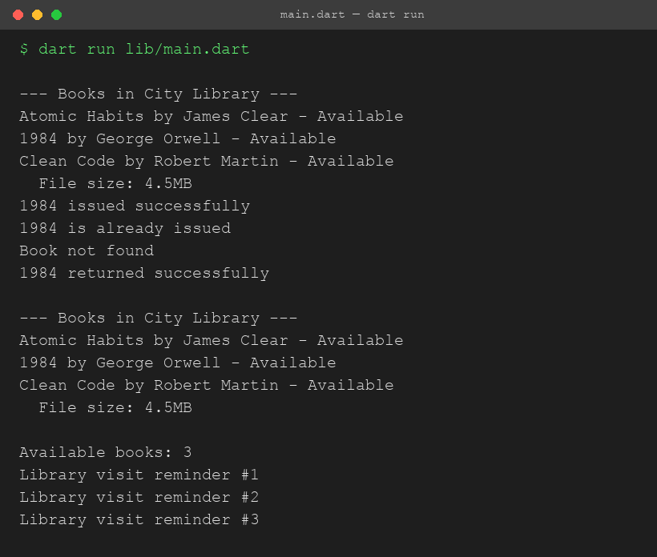

# Assignment 1 Report - Library System in Dart

## 1. What the assignment was

Write a Dart console program that uses variables, loops, functions, and OOP (a class with inheritance) to model a simple library system. I built a small library with books that can be added, issued, and returned, and I used a subclass to show inheritance.

## 2. How the program is structured

The project has one file per feature inside `lib`:

- `book.dart` holds the `Book` class.
- `digital_book.dart` holds `DigitalBook`, which extends `Book`.
- `library.dart` holds the `Library` class - adding, issuing, returning, and listing books.
- `book_utils.dart` holds `countAvailableBooks`, a standalone helper function.
- `main.dart` is just the entry point. It imports all the above, creates a `Library`, adds a few books, and calls its methods.

I split it this way so each file has one job. `digital_book.dart` and `library.dart` both import `book.dart` since they depend on the `Book` class, and `main.dart` imports everything to wire it all together.

## 3. Concepts I used

**Variables** - Every class has fields like `title`, `author`, `isIssued`, and in `DigitalBook`, `fileSizeMb`. I also used a local `count` variable inside the helper function.

**Loops** - `Library.showAllBooks()` loops through the `books` list with a `for-in` loop to print each one. `issueBook` and `returnBook` also loop through the list to find a book by title. In `main.dart` I used a regular `for (int i = 1; i <= 3; i++)` loop just to print a few reminder lines, to show a counted loop as well as a `for-in` loop.

**Functions** - `countAvailableBooks` is a standalone function (not a method) that takes a list of books and returns an int. The classes also have their own methods like `addBook`, `issueBook`, `returnBook`, and `showInfo`.

**OOP with inheritance** - `Book` is the base class with a constructor and a `showInfo()` method. `DigitalBook extends Book`, calls `super(title, author)` in its constructor, adds its own field `fileSizeMb`, and overrides `showInfo()` with `@override`, calling `super.showInfo()` first and then printing the extra file size line. This was the main inheritance part of the assignment.

## 4. Program output

This is the actual output from running `dart run lib/main.dart`:

```
--- Books in City Library ---
Atomic Habits by James Clear - Available
1984 by George Orwell - Available
Clean Code by Robert Martin - Available
  File size: 4.5MB
1984 issued successfully
1984 is already issued
Book not found
1984 returned successfully

--- Books in City Library ---
Atomic Habits by James Clear - Available
1984 by George Orwell - Available
Clean Code by Robert Martin - Available
  File size: 4.5MB

Available books: 3
Library visit reminder #1
Library visit reminder #2
Library visit reminder #3
```

Screenshot of this same run:



## 5. What I understood

Before this assignment I understood loops and functions fine on their own, but I hadn't really used inheritance in Dart specifically. Doing this made a few things click:

- A subclass constructor has to call the parent constructor, and in Dart that happens with `: super(...)` after the constructor's parameter list, not inside the body like I first assumed.
- `@override` isn't required to make overriding work, but it's good practice because the compiler will warn you if the method signature doesn't actually match anything in the parent class. That saved me from a silly mistake later.
- Calling `super.showInfo()` inside the overridden method let me reuse the parent's printing logic instead of copy-pasting it, which is the actual point of inheritance - extending behavior, not rewriting it.
- Keeping each class in its own file and importing them makes the entry point much easier to read, and it's closer to how a real Dart package would be laid out.

## 6. Challenges I faced and how I solved them

**Problem 1: Deciding what "issuing" a book should actually change.**
At first I wasn't sure if I should remove a book from the list when it's issued, or just mark it somehow. I went with a boolean field `isIssued` on the `Book` class instead of removing it from the list, because the library still owns the book, it's just not available. This turned out to be the simpler and more correct model.

**Problem 2: Inheritance constructor syntax.**
I initially wrote the `DigitalBook` constructor without calling the parent constructor properly and got a compile error about the superclass not being initialized. Once I looked at how the initializer list works (`: super(title, author)`), it made sense - the superclass fields have to be set before the subclass constructor body runs.

**Problem 3: Splitting into one file per class.**
When I first wrote everything in one `main.dart`, it worked, but it felt messy to have every class and the "running" logic in the same place. I split it into `book.dart`, `digital_book.dart`, `library.dart`, and `book_utils.dart`, and imported them where needed with plain relative imports like `import 'book.dart';`. Had a small mix-up with the import path at first since I was thinking I needed the full `lib/` prefix, but within the `lib` folder itself you just import by filename directly. I also had to remember that `digital_book.dart` and `library.dart` each need their own `import 'book.dart';` since Dart doesn't share imports across files automatically.

**Problem 4: Testing without a UI.**
Since this is a console program, I had to just run it directly and read the printed output carefully to check the behavior was right - like making sure issuing an already-issued book prints a proper message instead of just silently doing it again, and that returning a book that doesn't exist prints "Book not found" instead of crashing.

## 7. Conclusion

Overall this assignment helped me actually use inheritance in Dart instead of just reading about it, and it gave me practice organizing a small project into more than one file. The program covers all four required pieces - variables, loops, functions, and a class hierarchy with inheritance - and I tested it by running it and checking the output matched what I expected for each case (available book, already issued, book not found, and returning a book).
