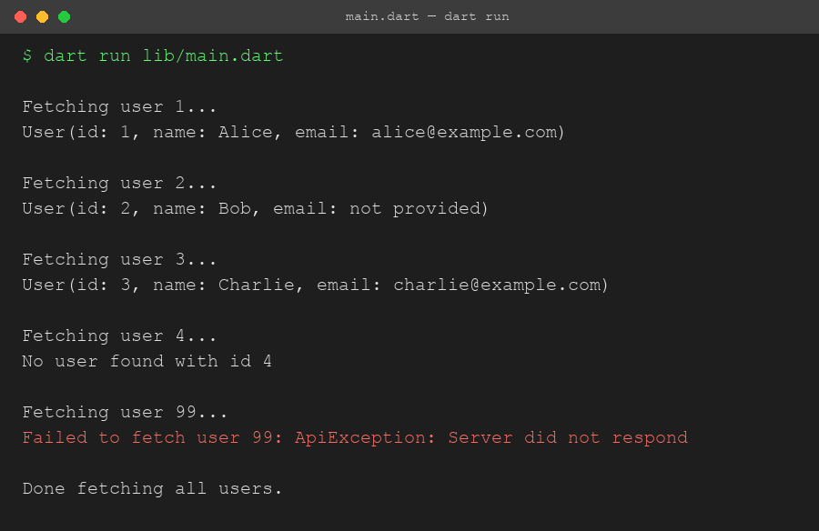

# Assignment 2 Report - Mock API Fetcher in Dart

## 1. What the assignment was

Build a Dart program using null safety, Future, and async/await to fetch and display mock API data, and handle null and error cases. Instead of calling a real API, I built a `MockApiService` that simulates a network call with a delay, and used it to fetch user records by id.

## 2. How the program is structured

The project has one file per feature inside `lib`:

- `user.dart` holds the `User` model. Its `email` field is `String?` since not every user has one.
- `api_exception.dart` holds a small custom `ApiException` class, thrown when the mock API "fails."
- `mock_api_service.dart` holds `MockApiService`, which has one method, `fetchUser(id)`, returning `Future<User?>`.
- `main.dart` is the entry point. It loops through a list of ids and calls `fetchUser` for each one, printing the result.

`mock_api_service.dart` imports both `user.dart` and `api_exception.dart` since it returns one and can throw the other. `main.dart` only needs to import `mock_api_service.dart`.

## 3. Concepts I used

**Null safety** - `User.email` is typed `String?` because a user might not have one. In `User.toString()` I used `email ?? "not provided"` so a missing email prints something readable instead of `null`. `fetchUser` itself returns `Future<User?>`, so the caller has to handle the case where the user doesn't exist at all, not just a missing field.

**Future** - `fetchUser` returns a `Future<User?>` instead of a plain `User?`, because the whole point is that it doesn't resolve immediately - it's meant to represent a network call. Inside it, `Future.delayed(Duration(seconds: 1))` fakes that network delay.

**async/await** - `fetchUser` is declared `async` so I can `await` the delay inside it. `printUser` in `main.dart` is also `async` so it can `await service.fetchUser(id)` and get the actual `User?` back instead of a `Future` wrapper. `main()` itself is `async` too, and awaits `printUser` in a loop so the fetches happen one at a time in order instead of all firing at once.

**Handling null and error cases** - Two separate failure paths get handled differently, on purpose:
- If the id just doesn't exist in the mock database, `fetchUser` returns `null` - that's a normal, expected outcome, not an error. `main.dart` checks `if (user == null)` and prints a plain "not found" message.
- If the id is `99`, `fetchUser` throws an `ApiException` - that represents an actual failure (like a dead server), and it's caught with `try/catch` in `printUser`, printing the error instead of letting the program crash.

## 4. Program output

This is the actual output from running `dart run lib/main.dart`:

```
Fetching user 1...
User(id: 1, name: Alice, email: alice@example.com)

Fetching user 2...
User(id: 2, name: Bob, email: not provided)

Fetching user 3...
User(id: 3, name: Charlie, email: charlie@example.com)

Fetching user 4...
No user found with id 4

Fetching user 99...
Failed to fetch user 99: ApiException: Server did not respond

Done fetching all users.
```

Screenshot of this same run:



## 5. What I understood

Before this assignment I'd used `async`/`await` a little, but mostly copy-pasted without really thinking about what a `Future` was doing underneath. Doing this made a few things click:

- A `Future<User?>` is not the same as a `User?` - you can't just check it for null directly, you have to `await` it first to get the actual value out. I made this mistake once while testing and got a weird "not equal" comparison against a `Future` object instead of a real user.
- Returning `null` and throwing an exception are two different ways of saying "this didn't work," and they mean different things. `null` here means "the API worked fine, there's just nothing at that id." An exception means "the API itself failed." Mixing those up would make the caller's code confusing, since you'd have to guess whether a failure is normal or not.
- `??` is a clean way to give a default when something might be null, instead of writing an `if` check every time you want to print or use the value.
- Marking `main()` itself as `async` is what lets you `await` things directly inside it, which I hadn't done before - I'd always awaited inside some other function and called that from a non-async `main`.

## 6. Challenges I faced and how I solved them

**Problem 1: Forgetting to await the Future.**
On my first pass I wrote `final user = service.fetchUser(id);` without `await`, then tried to check `user == null` right away. Since a `Future` object itself is never `null`, that check always passed, and printing `user` just showed something like `Instance of 'Future<User?>'` instead of the actual data. Adding `await` in front of the call fixed it, since that's what actually waits for the value and unwraps it.

**Problem 2: Deciding between returning null and throwing.**
At first I was tempted to just throw an exception for every failure case, including "user not found." But that didn't feel right, since "not found" is a completely normal outcome for a lookup, not a system failure. I split it: missing id returns `null` and gets handled with a plain `if` check, while an actual simulated server failure (id `99`) throws `ApiException` and gets handled with `try/catch`. This made the calling code in `main.dart` read more clearly, since the two cases are visibly different in how they're handled.

**Problem 3: Making the delay actually visible.**
Since everything runs so fast normally, without `Future.delayed` the "async" part wouldn't really be demonstrating anything - it would look the same as if I'd just written synchronous code. Adding a one second delay inside `fetchUser` made it obvious in the output that each fetch actually takes time, and running them with `await` inside a loop (instead of firing them all at once) meant they visibly happen one after another.

**Problem 4: Custom exception class.**
I wasn't sure at first if I needed a whole class for this or could just `throw 'some string'`. I went with a small class implementing `Exception` (`ApiException`) instead, since it's the more correct pattern in Dart and let me override `toString()` to control exactly how the error prints, plus it's more specific than a raw string if I ever wanted to catch just `ApiException` and not other error types.

## 7. Conclusion

This assignment made the difference between a `Future` and its resolved value, and the difference between "null" and "error," a lot more concrete than just reading about them. The program covers all the required pieces - null safety with a nullable field and the `??` operator, a `Future`-returning method, `async`/`await` used at multiple levels, and both a null case and a thrown-exception case handled separately - and I tested it by running it and checking every id in the list produced the output I expected.
