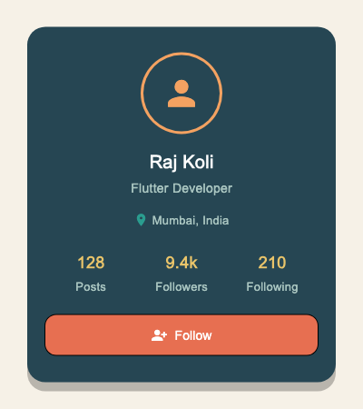

# Assignment 3 Report - Profile Card Screen in Flutter

## 1. What the assignment was

Build a Flutter profile card screen using `Column`, `Row`, `Container`, `CircleAvatar`, `Text`, and `Icon` widgets, with custom theme colors instead of the default Material palette.

## 2. Files

- `app_colors.dart` - one class, `AppColors`, holding the custom palette as static constants.
- `profile_stat.dart` - `ProfileStat` (a simple label/value model) and `ProfileStatColumn`, the widget that displays one.
- `profile_card.dart` - `ProfileCard`, the card itself: avatar, name, role, location row, stats row, follow button.
- `main.dart` - `ProfileApp` sets up `MaterialApp` with the custom background color, `ProfileScreen` centers a `ProfileCard` on screen.

## 3. Concepts used

**Container** - the card is a `Container` with fixed width, padding, rounded corners, a background color from `AppColors`, and a drop shadow.

**Column / Row** - `Column` stacks the avatar, name, role, location, stats, and button vertically. `Row` is used twice: once for the location line (icon + text side by side), once for the three stats spread across the card.

**CircleAvatar** - two nested `CircleAvatar`s make the ring around the icon: an outer one for the accent-colored ring, an inner one for the dark circle with the person icon on top.

**Text / Icon** - every label on the card is `Text` with a style pulled from `AppColors`. `Icon` is used for the location pin, the person icon in the avatar, and the icon on the follow button.

**Custom theme colors** - `AppColors` holds a five-color palette (charcoal blue, verdigris, tuscan sun, sandy brown, burnt peach) and assigns each one a role: charcoal blue for the card, sandy brown for the avatar ring, verdigris for the location pin, tuscan sun for the stat numbers, burnt peach for the follow button. Nothing on the card uses a default Material color.

## 4. Output

Screenshot of the actual widget, rendered from the real `ProfileScreen`:

## 5. What I understood

- A `Container`'s `decoration` (color, radius, shadow) can't be set together with a plain `color` property - once you need rounded corners or a shadow, the color has to move inside `BoxDecoration`.
- Nesting two `CircleAvatar`s is a simple way to fake a ring/border around an avatar without drawing a custom shape.
- Centralizing colors in one `AppColors` class made it easy to keep the palette consistent - I only had to change a value in one place while tuning it.
- `Row` doesn't shrink its children by default - if the content is wider than the space available, it overflows instead of wrapping.

## 6. Challenges

**Row overflow.** The stats row (Posts / Followers / Following) overflowed the card width with a yellow-and-black striped warning in the console. Fixed by wrapping each stat in `Expanded` so the three columns share the row width instead of taking their natural size.

**Getting a real screenshot without a running emulator.** I didn't want to depend on a simulator being open, so I rendered the actual widget tree in a Flutter test and saved it as a PNG instead of a mockup.

**Picking colors that actually look custom.** First pass reused Material blue and just changed the background, which barely looked different from the default theme. Switched to a five-color palette (charcoal blue, verdigris, tuscan sun, sandy brown, burnt peach) and gave each color one clear job on the card instead of reusing the same accent everywhere, which made the "custom theme" part of the assignment obvious at a glance.

## 7. Conclusion

This covers all five required widgets - `Column`, `Row`, `Container`, `CircleAvatar`, `Text`, and `Icon` - plus a custom color palette applied throughout instead of Material defaults. Tested by running the widget and checking the layout held together at the target size, with no overflow warnings.
