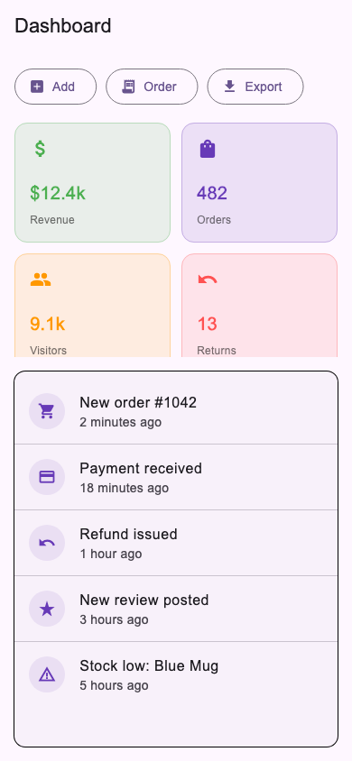
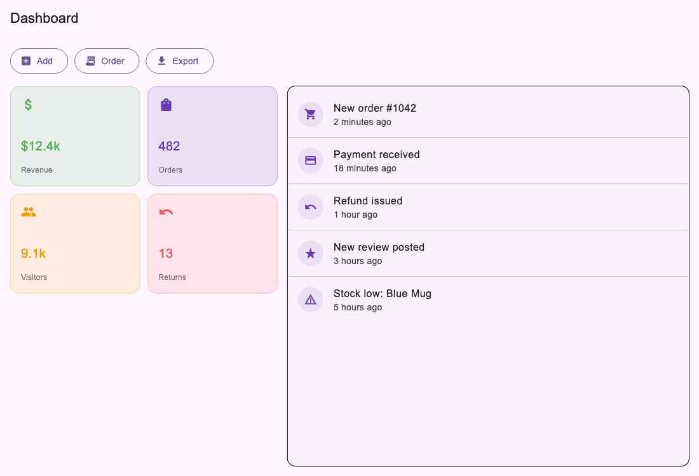

# Assignment 4 Report - Responsive Dashboard in Flutter

## 1. What the assignment was

Create a responsive multi-section dashboard using `ListView`, `GridView`, `MediaQuery`, and `Flexible`/`Expanded` that adapts to screen size.

## 2. Files

- `stat_item.dart` - `StatItem` model and `StatCard`, one tile in the stats grid.
- `stats_grid.dart` - `StatsGrid`, wraps `GridView.builder` and picks its own column count from the space it's given.
- `activity_item.dart` - `ActivityItem` model and `ActivityTile`, one row in the activity list.
- `activity_list.dart` - `ActivityList`, wraps `ListView.separated`.
- `quick_actions.dart` - `QuickActionsBar`, a `Row` of `Flexible`-wrapped buttons.
- `dashboard_screen.dart` - assembles all sections and switches the overall layout based on `MediaQuery`.
- `main.dart` - entry point.

## 3. Concepts used

**GridView** - `StatsGrid` uses `GridView.builder` with `SliverGridDelegateWithFixedCrossAxisCount` to lay out the stat cards.

**ListView** - `ActivityList` uses `ListView.separated` for the recent activity feed, with a divider between rows.

**MediaQuery** - `DashboardScreen` reads `MediaQuery.of(context).size.width` to decide whether the stats grid and activity list sit side by side (wide screen) or stacked (narrow screen).

**Flexible / Expanded** - the quick actions row wraps each button in `Flexible` so they shrink instead of overflowing on a narrow screen. The two-section layout uses `Expanded` (with different `flex` values) to split the width on wide screens, and `Expanded` again to let the activity list fill the remaining height on narrow screens.

**Responsive layout** - two different structures for wide vs narrow, not just resized widgets: `Row` with `Expanded` panels side by side on wide screens, `Column` with a fixed-height grid and an `Expanded` list underneath on narrow screens.

## 4. Output

Phone width (390px):

Desktop width (1100px):

## 5. What I understood

- `MediaQuery.of(context).size` gives the full screen size, but a widget nested inside a `Row`/`Expanded` doesn't get that much space - it only gets its share. Column counts and sizing decisions are safer based on the widget's own constraints, not the screen's.
- `Flexible` lets a child shrink below its natural size when there isn't room; without it, a `Row` of buttons just overflows instead of adjusting.
- `Expanded` is `Flexible` with `FlexFit.tight` - it forces the child to fill the space instead of just allowing it to.
- `GridView` and `ListView` both need a bounded height unless they're the direct child of something like `Expanded` that gives them one.

## 6. Challenges

**Grid columns based on the wrong width.** First version picked the `GridView` column count from `MediaQuery`'s full screen width. On a wide screen the grid only got a fraction of that width (it was sharing the row with the activity list via `Expanded(flex: 2)`), so the cards were forced too narrow and overflowed. Fixed by wrapping `StatsGrid` in a `LayoutBuilder` and picking the column count from its own `constraints.maxWidth` instead of the screen width.

**Quick action labels getting clipped.** On the narrow layout, `Flexible` buttons with longer labels like "Add product" got squeezed down to "Add ..." with an ellipsis. Shortened the labels instead of fighting the layout for more space.

**Bounded height for ListView inside Column.** On the narrow layout, `ListView` can't just be dropped into a `Column` - it needs a bounded height. Solved it by wrapping the grid in a fixed-height `SizedBox` and wrapping the list in `Expanded`, so the list gets whatever height is left.

## 7. Conclusion

This covers all four required pieces - `ListView`, `GridView`, `MediaQuery`, and `Flexible`/`Expanded` - with the layout genuinely restructuring itself (not just resizing) between phone and desktop widths. Tested by rendering the dashboard at both a phone size and a desktop size and confirming no overflow warnings and no leftover empty space at either size.
