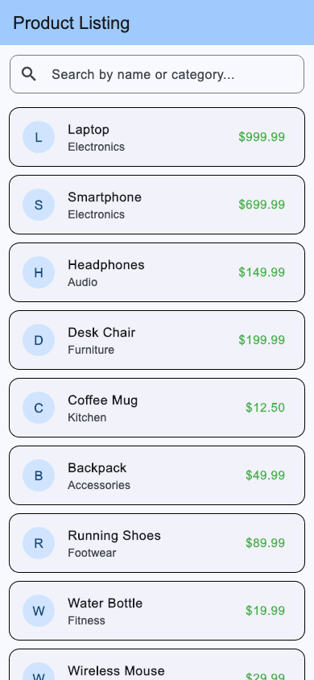

# Assignment 6 Report - Dynamic Product Listing and Search in Flutter

## 1. What the assignment was

Create a dynamic product listing using `ListView.builder` with a data model class, and implement search/filter functionality using `setState`.

## 2. Files

- `product_item.dart` - `Product` data model class and `ProductTile` widget, rendering individual product cards.
- `product_list_screen.dart` - `ProductListScreen`, manages the search query input, dynamic filtering via `setState`, and `ListView.builder`.
- `main.dart` - entry point setting up `MaterialApp` with Material 3 theming.

## 3. Concepts used

**Data Model Class** - `Product` defines the data structure (`name`, `category`, `price`). Using a model class ensures type safety and makes it easy to pass and format structured data throughout the app.

**ListView.builder** - Renders the product list on demand as the user scrolls, creating only the visible items. It efficiently binds to the dynamic `_filteredProducts` list length.

**setState for Reactive Filtering** - As the user types into the `TextField`, the `onChanged` callback calls `_filterProducts(query)`. `setState` triggers a UI rebuild with the newly filtered subset of products matching either the product name or category (case-insensitive).

**Card & ListTile UI** - Each item is displayed inside a styled `Card` with a `ListTile` containing a leading `CircleAvatar` displaying the product initial, title, category subtitle, and price badge.

**Empty State Handling** - When a search returns no matching items, a clean fallback message ("No products found") is rendered instead of an empty list.

## 4. Output

All products view (phone):

Search and filtered view (phone):

## 5. What I understood

- `ListView.builder` is much more memory efficient than default `ListView` when working with dynamic or large datasets, because items are created lazily only when they come into view.
- `setState` informs Flutter that internal state has changed, prompting a call to the `build` method to reconcile the UI against the updated data.
- Keeping the master list (`_allProducts`) separate from the visible list (`_filteredProducts`) is essential; modifying the original list directly would permanently erase data during filtering.
- Reusable component separation (e.g., separating `ProductTile` into its own file) keeps screens uncluttered and promotes clean code architecture.

## 6. Challenges

**Avoiding mutating the original list.** If filtering mutated `_allProducts` directly, clearing the search query or backspacing would not restore previously filtered-out items. Resolved by keeping `_allProducts` constant and maintaining a separate `_filteredProducts` list in state that updates dynamically.

**Case sensitivity in search.** A strict string comparison causes search terms like "laptop" to miss "Laptop". Solved by converting both the search term and product fields to lowercase (`toLowerCase()`) during comparison.

**Searching across multiple fields.** Users might search by category (e.g., "Electronics") or by name (e.g., "Headphones"). Solved by checking both `product.name` and `product.category` within the filter condition.

## 7. Conclusion

This project satisfies all required criteria: a structured `Product` data model, efficient dynamic list rendering with `ListView.builder`, and real-time search/filter capabilities driven by `setState`. The code is cleanly structured into separate files for readability and maintainability.
