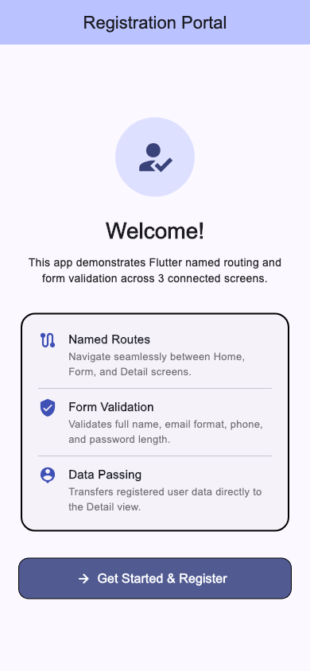
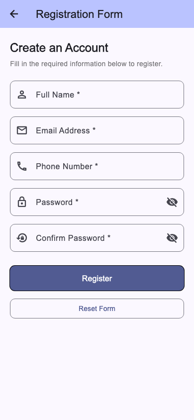
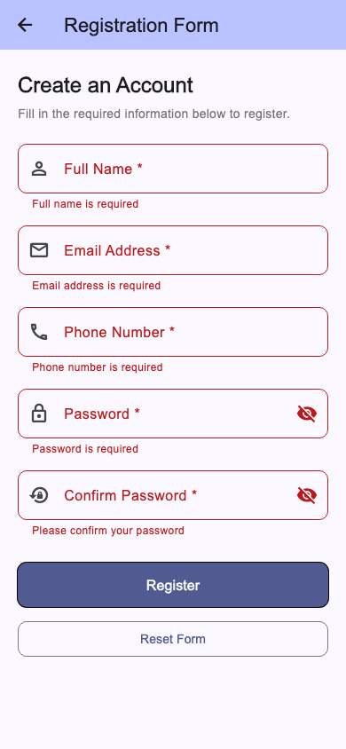
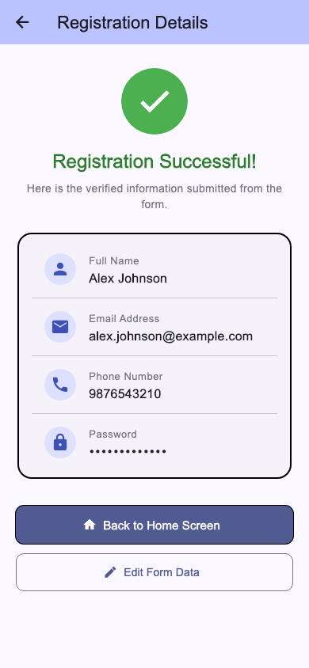

# Assignment 7 Report - 3-Screen App with Named Routes & Form Validation

## 1. What the assignment was

Build a 3-screen Flutter app (Home, Form, Detail) using named routes, and implement a registration form with comprehensive validation (email, password, required fields).

## 2. Files

- `user_data.dart` - `UserRegistration` data model class encapsulating registered user fields (`fullName`, `email`, `phone`, `password`).
- `home_screen.dart` - `HomeScreen` (route `/`), welcoming users and providing entry to the registration flow.
- `form_screen.dart` - `FormScreen` (route `/form`), manages the registration form, input controllers, field validators, and submission handling.
- `detail_screen.dart` - `DetailScreen` (route `/detail`), retrieves arguments passed via named route and renders a verified user profile summary.
- `main.dart` - entry point defining `MaterialApp` with Material 3 theming and the central named route registry (`routes` table).

## 3. Concepts used

**Named Routes Navigation** - Instead of inline `MaterialPageRoute` calls, routes are declared centrally in `main.dart` via `initialRoute` and `routes: { '/': ..., '/form': ..., '/detail': ... }`. Navigation is triggered using `Navigator.pushNamed()` and `Navigator.pushNamedAndRemoveUntil()`.

**Route Arguments Passing** - When the registration form is successfully validated, a `UserRegistration` object is passed directly through `Navigator.pushNamed(context, '/detail', arguments: user)`. The destination screen retrieves it cleanly using `ModalRoute.of(context)!.settings.arguments as UserRegistration`.

**Form & FormState Management** - The form is bound to a `GlobalKey<FormState>()`. Calling `_formKey.currentState!.validate()` runs all field validators simultaneously and toggles validation error displays across invalid inputs.

**Input Validation & Regular Expressions** - Built custom validator logic for:
- Required field validation (verifying non-empty, trimmed input).
- Email pattern validation using regular expression `r'^[\w-\.]+@([\w-]+\.)+[\w-]{2,4}$'`.
- 10-digit phone number check.
- Minimum password length constraint (>= 6 characters).
- Password confirmation matching check.

**User Experience & Feedback** - Includes password visibility toggles (`obscureText`), clear helper/hint texts, input action progression (`textInputAction: TextInputAction.next`), and a Form Reset action.

## 4. Output

### Home Screen (Phone 390x844):

### Registration Form Screen:

### Active Validation Errors:

### Detail Screen (Registered User Profile):

## 5. What I understood

- Named routes provide a single source of truth for application page hierarchy, decoupling screens from one another and simplifying navigation logic.
- `GlobalKey<FormState>` enables global form validation and resetting without managing manual error boolean flags for each field.
- Using a typed data model for route arguments keeps screen contracts type-safe and prevents parameter mismatches.
- `SingleChildScrollView` combined with `SafeArea` ensures forms remain accessible without keyboard overflow or notch clipping issues on various device sizes.

## 6. Challenges

**Keyboard overflow and scrolling.** Registration forms with multiple fields frequently exceed screen heights when mobile virtual keyboards pop up. Fixed by wrapping the form in a `SingleChildScrollView` with appropriate padding.

**Retaining and resetting field values.** Managing individual text controllers alongside `FormState` requires properly clearing both the text controllers and calling `_formKey.currentState?.reset()`. Disposing all controllers in the `dispose()` lifecycle prevents memory leaks.

**Safe retrieval of route arguments.** If the detail route is pushed directly without arguments, unwrapping `settings.arguments` could throw null cast exceptions. Solved by safely casting to `UserRegistration?` and providing a graceful error/redirect view if arguments are missing.

## 7. Conclusion

This project satisfies all required specifications: a structured 3-screen app utilizing named routes (`/`, `/form`, `/detail`), complete registration form validation across email, password, and required inputs, and seamless argument transmission displaying the registered user details.
